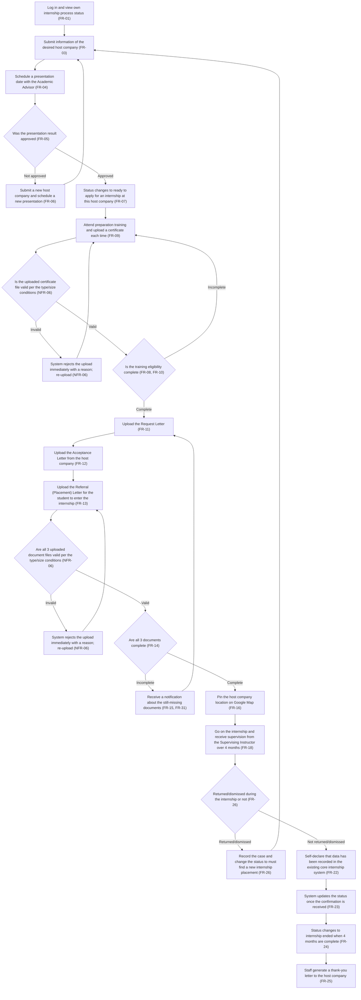
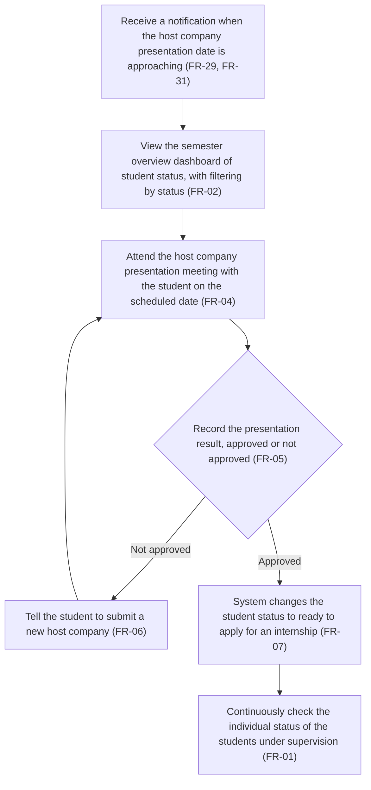
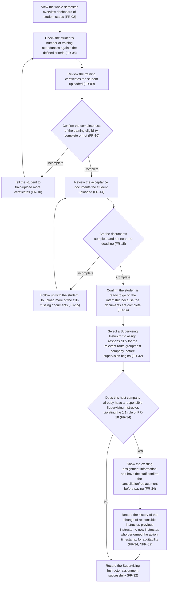
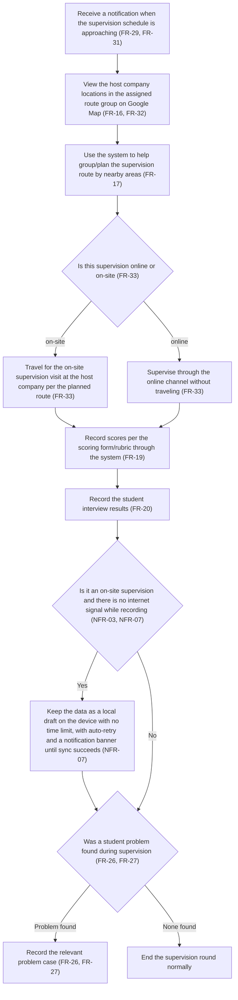
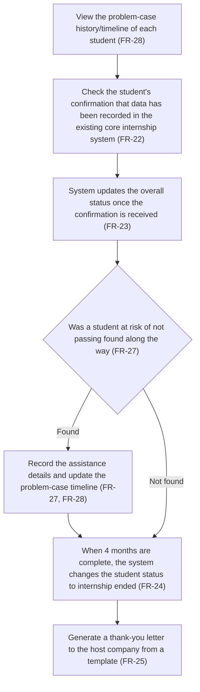

# User Journey — Student Internship Process Tracking System

Maps the features from the [feature-list](./feature-list.md) into real usage flows by user role. Always refer to the full details in the [source spec](../requirements/spec.md) and the FR/NFR codes in the [backlog](../requirements/backlog.md).

Each journey has a Mermaid flowchart before the text-based step list, so the overview can be grasped quickly before reading the details — each node in the diagram always corresponds one-to-one with a text-based step below.

## Journey: Student — the internship path from submitting a host company to completion

Role: Student

Steps:
1. Log in and view own internship process status ([FR-01](./feature-list.md))
2. Submit information of the desired host company ([FR-03](./feature-list.md))
3. Schedule a presentation date with the Academic Advisor (FR-04)
4. Await the presentation result from the Academic Advisor — approved or not approved (FR-05)
   - If not approved: submit a new host company and schedule a new presentation, repeatable until approved, then return to step 2 (FR-06)
   - If approved: go to the next step
5. Status changes to "ready to apply for an internship at this host company" (FR-07)
6. Attend preparation training and upload a certificate each time ([FR-09](./feature-list.md))
7. The system checks whether the uploaded certificate file is valid per the conditions (type PDF/JPG/PNG, no larger than 10MB) or not (NFR-06)
   - If invalid: the system rejects the upload immediately with a message explaining the reason; re-upload the file (return to step 6) (NFR-06)
   - If valid: go to the next step
8. Await the staff to review and confirm the completeness of the training eligibility — complete or not (FR-08, FR-10)
   - If incomplete: go back to training/upload more certificates (return to step 6)
   - If complete: go to the next step
9. Upload the Request Letter ([FR-11](./feature-list.md))
10. Upload the Acceptance Letter from the host company (FR-12)
11. Upload the Referral (Placement) Letter for the student to enter the internship (FR-13)
12. The system checks whether all 3 uploaded document files are valid per the conditions (type/size) or not (NFR-06)
    - If invalid: the system rejects the upload immediately with a message explaining the reason; re-upload (return to step 11) (NFR-06)
    - If valid: go to the next step
13. The system checks the completeness of all 3 documents — complete or not (FR-14)
    - If incomplete: receive a notification about the still-missing documents, per the configurable lead-time notification policy (default 7 days), then go back to upload the missing documents (step 9) (FR-15, FR-31)
    - If complete: go to the next step
14. Pin the host company location on Google Map ([FR-16](./feature-list.md))
15. Go on the internship and receive supervision from the Supervising Instructor during the 4-month internship ([FR-18](./feature-list.md))
16. During the internship, returned/dismissed or not ([FR-26](./feature-list.md))
    - If returned/dismissed: record the case and change the status to "must find a new internship placement", then go back to submit a new host company (step 2) (FR-26)
    - If not returned/dismissed: go to the next step
17. Self-declare that data has been recorded in the existing core internship system ([FR-22](./feature-list.md))
18. The system updates the status once the confirmation is received (FR-23)
19. When the planned 4 months are complete, the status changes to "internship ended" ([FR-24](./feature-list.md))
20. The staff generate a thank-you letter to the host company from a template (FR-25)

## Journey: Academic Advisor — review and approve host companies and track the overview

Role: Academic Advisor/internship approver

Steps:
1. Receive a notification when the host company presentation date is approaching, per the configurable lead-time notification policy (default 7 days) ([FR-29, FR-31](./feature-list.md))
2. View the semester overview dashboard of student status, with filtering by status ([FR-02](./feature-list.md))
3. Attend the host company presentation meeting with the student on the scheduled date ([FR-04](./feature-list.md))
4. Record the presentation result along with accompanying comments — approved or not approved (FR-05)
   - If not approved: tell the student to submit a new host company, then go back to await a new presentation date (step 3) (FR-06)
   - If approved: go to the next step
5. The system changes the student status to "ready to apply for an internship at this host company" (FR-07)
6. Continuously check the individual status of the students under supervision (FR-01)

## Journey: Internship Coordinator — verify eligibility, documents, and assign Supervising Instructors before the internship starts

Role: Internship Coordinator

Steps:
1. View the whole-semester overview dashboard of student status ([FR-02](./feature-list.md))
2. Check the student's number of training attendances against the defined criteria ([FR-08](./feature-list.md))
3. Review the training certificates the student uploaded (FR-09)
4. Confirm the completeness of the training eligibility — complete or not (FR-10)
   - If incomplete: tell the student to train/upload more certificates, then go back to review again (step 2) (FR-10)
   - If complete: go to the next step
5. Review the acceptance documents the student uploaded (Request Letter/Acceptance Letter/Referral (Placement) Letter) ([FR-14](./feature-list.md))
6. The system notifies if the documents are still incomplete near the deadline — complete or not (FR-15)
   - If incomplete: follow up with the student to upload more of the still-missing documents, then go back to review again (step 5) (FR-15)
   - If complete: go to the next step
7. Confirm the student is ready to go on the internship because the documents are complete (FR-14)
8. Select a Supervising Instructor to assign responsibility for the relevant route group/host company, before supervision begins ([FR-32](./feature-list.md))
9. Check whether this host company already has a responsible Supervising Instructor — whether it violates the 1-Supervising-Instructor-per-company rule of FR-18 or not ([FR-34](./feature-list.md))
   - If yes: the system must not reject immediately and must not replace automatically, but shows the existing assignment information (the name of the previous Supervising Instructor) for the staff to confirm the cancellation/replacement first; the system then records the history of the change of responsible instructor (previous instructor → new instructor, who performed the action, timestamp) for auditability, and only then can the new instructor be saved (FR-34, NFR-02)
   - If no: can go to the next step immediately
10. The system records the Supervising Instructor assignment successfully (FR-32)

## Journey: Supervising Instructor — supervise the student during the internship

Role: Supervising Instructor (1 per company, per the assigned route group)

Steps:
1. Receive a notification when the supervision schedule is approaching, per the configurable lead-time notification policy (default 7 days) ([FR-29, FR-31](./feature-list.md))
2. View the host company locations in the assigned route group on Google Map ([FR-16, FR-32](./feature-list.md))
3. Use the system to help group/plan the supervision route by nearby areas (FR-17)
4. Specify whether this supervision is online or on-site ([FR-33](./feature-list.md))
   - If on-site: travel for the on-site supervision visit at the host company per the planned route (FR-33)
   - If online: supervise through the online channel without traveling (FR-33)
5. Record scores per the scoring form/rubric through the system, whether the supervision is online or on-site (FR-19)
6. Record the student interview results (FR-20)
7. Is it an on-site supervision and there is no internet signal while recording or not (NFR-03, NFR-07)
   - If yes: the system keeps the data as a local draft on the device with no time limit, with automatic auto-retry when the signal returns, and shows a message/banner notification throughout the period there is data still pending sync (the draft is not auto-deleted no matter how long it is pending) — this condition is enforced for on-site only; online supervision does not need to meet this condition (NFR-03, NFR-07)
   - If no (there is a signal, or it is online): go to the next step
8. Was a student problem found during supervision or not ([FR-26, FR-27](./feature-list.md))
   - If found: record the relevant problem case (returned/dismissed or at risk of not passing) (FR-26, FR-27)
   - If not found: end the supervision round normally

## Journey: Internship Coordinator — handle problem cases and end the internship

Role: Internship Coordinator

Steps:
1. View the problem-case history/timeline of each student ([FR-28](./feature-list.md))
2. Check the student's confirmation that data has been recorded in the existing core internship system ([FR-22](./feature-list.md))
3. The system updates the overall status once the confirmation is received (FR-23)
4. Was a student at risk of not passing found along the way or not (FR-27)
   - If found: record the details of the assistance carried out, and update the problem-case timeline (FR-27, FR-28)
   - If not found: go to the next step
5. When the planned 4 months are complete, the system changes the student status to "internship ended" ([FR-24](./feature-list.md))
6. Generate a thank-you letter to the host company from a template (FR-25)

## Related documents

- [feature-list](./feature-list.md) — the full list of features with MoSCoW
- [backlog](../requirements/backlog.md) — summary of all FR/NFR in the project
- [source spec](../requirements/spec.md) — the source spec document
