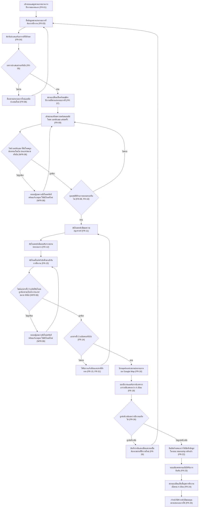
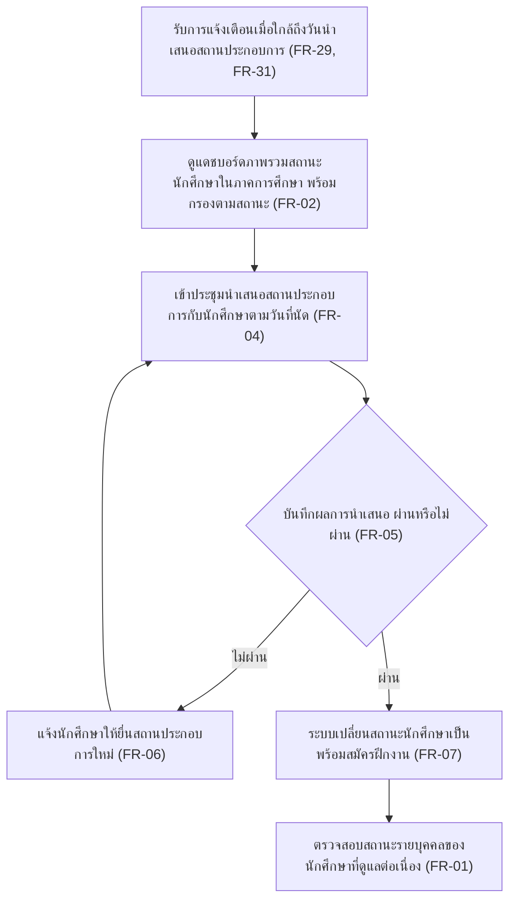
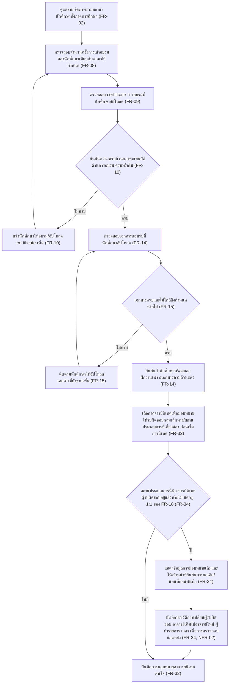
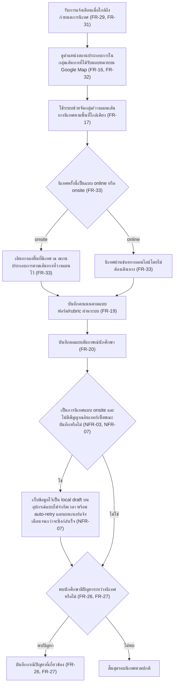
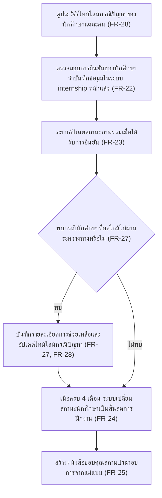

# User Journey — ระบบติดตามกระบวนการฝึกงานนักศึกษา

แมปฟีเจอร์จาก [feature-list](./feature-list.md) เป็น flow การใช้งานจริงตามบทบาทผู้ใช้ อ้างอิงรายละเอียดเต็มจาก
[spec](../requirements/spec.md) และรหัส FR/NFR จาก [backlog](../requirements/backlog.md) เสมอ

แต่ละ journey มีแผนภาพ Mermaid flowchart กำกับก่อนรายการขั้นตอนแบบข้อความ เพื่อให้เห็นภาพรวมได้เร็ว
ก่อนอ่านรายละเอียด — node ในแผนภาพตรงกับขั้นตอนแบบข้อความด้านล่างทีละอันเสมอ

## Journey: นักศึกษา — เส้นทางการฝึกงานตั้งแต่ยื่นสถานประกอบการจนจบ

บทบาท: นักศึกษา

ขั้นตอน:
1. เข้าระบบและดูสถานะกระบวนการฝึกงานของตนเอง ([FR-01](./feature-list.md))
2. ยื่นข้อมูลสถานประกอบการที่ต้องการฝึกงาน ([FR-03](./feature-list.md))
3. นัดวันนำเสนอกับอาจารย์ที่ปรึกษา (FR-04)
4. รอผลการนำเสนอจากอาจารย์ที่ปรึกษา — ผ่านหรือไม่ผ่าน (FR-05)
   - ถ้าไม่ผ่าน: ยื่นสถานประกอบการใหม่และนัดนำเสนอใหม่ ทำซ้ำได้จนกว่าจะผ่าน แล้วย้อนกลับไปขั้นตอน 2 (FR-06)
   - ถ้าผ่าน: ไปขั้นตอนถัดไป
5. สถานะเปลี่ยนเป็น "พร้อมสมัครฝึกงานที่สถานประกอบการนี้" (FR-07)
6. เข้าอบรมเตรียมความพร้อมและอัปโหลด certificate แต่ละครั้ง ([FR-09](./feature-list.md))
7. ระบบตรวจสอบไฟล์ certificate ที่อัปโหลดว่าถูกต้องตามเงื่อนไข (ประเภท PDF/JPG/PNG ขนาดไม่เกิน 10MB) หรือไม่ (NFR-06)
   - ถ้าไม่ถูกต้อง: ระบบปฏิเสธการอัปโหลดทันทีพร้อมข้อความแจ้งเหตุผล ให้อัปโหลดไฟล์ใหม่ (ย้อนกลับไปขั้นตอน 6) (NFR-06)
   - ถ้าถูกต้อง: ไปขั้นตอนถัดไป
8. รอเจ้าหน้าที่ตรวจสอบและยืนยันความครบถ้วนของคุณสมบัติด้านการอบรม — ครบหรือไม่ (FR-08, FR-10)
   - ถ้าไม่ครบ: กลับไปอบรม/อัปโหลด certificate เพิ่ม (ย้อนกลับไปขั้นตอน 6)
   - ถ้าครบ: ไปขั้นตอนถัดไป
9. อัปโหลดหนังสือขอความอนุเคราะห์ ([FR-11](./feature-list.md))
10. อัปโหลดหนังสือตอบรับจากสถานประกอบการ (FR-12)
11. อัปโหลดใบส่งตัวนักศึกษาเข้ารับการฝึกงาน (FR-13)
12. ระบบตรวจสอบไฟล์เอกสารทั้ง 3 ฉบับที่อัปโหลดว่าถูกต้องตามเงื่อนไข (ประเภท/ขนาด) หรือไม่ (NFR-06)
    - ถ้าไม่ถูกต้อง: ระบบปฏิเสธการอัปโหลดทันทีพร้อมข้อความแจ้งเหตุผล ให้อัปโหลดใหม่ (ย้อนกลับไปขั้นตอน 11) (NFR-06)
    - ถ้าถูกต้อง: ไปขั้นตอนถัดไป
13. ระบบตรวจสอบความครบถ้วนของเอกสารทั้ง 3 ฉบับ — ครบหรือไม่ (FR-14)
    - ถ้าไม่ครบ: ได้รับการแจ้งเตือนเอกสารที่ยังขาด ตามนโยบายเวลาแจ้งเตือนล่วงหน้าที่ปรับได้ (ค่าเริ่มต้น 7 วัน) แล้วย้อนกลับไปอัปโหลดเอกสารที่ขาด (ขั้นตอน 9) (FR-15, FR-31)
    - ถ้าครบ: ไปขั้นตอนถัดไป
14. ปักหมุดตำแหน่งสถานประกอบการบน Google Map ([FR-16](./feature-list.md))
15. ออกฝึกงานและรับการนิเทศจากอาจารย์นิเทศระหว่างฝึกงาน 4 เดือน ([FR-18](./feature-list.md))
16. ระหว่างฝึกงาน ถูกส่งตัวกลับหรือไม่ ([FR-26](./feature-list.md))
    - ถ้าถูกส่งตัวกลับ: บันทึกกรณีและเปลี่ยนสถานะเป็น "ต้องหาสถานที่ฝึกงานใหม่" แล้วย้อนกลับไปยื่นสถานประกอบการใหม่ (ขั้นตอน 2) (FR-26)
    - ถ้าไม่ถูกส่งตัวกลับ: ไปขั้นตอนถัดไป
17. ยืนยันด้วยตนเองว่าได้บันทึกข้อมูลในระบบ internship หลักแล้ว ([FR-22](./feature-list.md))
18. ระบบอัปเดตสถานะเมื่อได้รับการยืนยัน (FR-23)
19. เมื่อครบ 4 เดือนตามแผน สถานะเปลี่ยนเป็น "สิ้นสุดการฝึกงาน" ([FR-24](./feature-list.md))
20. เจ้าหน้าที่สร้างหนังสือขอบคุณสถานประกอบการจากแม่แบบให้ (FR-25)

## Journey: อาจารย์ที่ปรึกษา — พิจารณาอนุมัติสถานประกอบการและติดตามภาพรวม

บทบาท: อาจารย์ที่ปรึกษา/ผู้อนุมัติการฝึกงาน

ขั้นตอน:
1. รับการแจ้งเตือนเมื่อใกล้ถึงวันนำเสนอสถานประกอบการ ตามนโยบายเวลาแจ้งเตือนล่วงหน้าที่ปรับได้ (ค่าเริ่มต้น 7 วัน) ([FR-29, FR-31](./feature-list.md))
2. ดูแดชบอร์ดภาพรวมสถานะนักศึกษาในภาคการศึกษา พร้อมกรองตามสถานะ ([FR-02](./feature-list.md))
3. เข้าประชุมนำเสนอสถานประกอบการกับนักศึกษาตามวันที่นัด ([FR-04](./feature-list.md))
4. บันทึกผลการนำเสนอพร้อมความเห็นประกอบ — ผ่านหรือไม่ผ่าน (FR-05)
   - ถ้าไม่ผ่าน: แจ้งนักศึกษาให้ยื่นสถานประกอบการใหม่ แล้วย้อนกลับไปรอวันนำเสนอใหม่ (ขั้นตอน 3) (FR-06)
   - ถ้าผ่าน: ไปขั้นตอนถัดไป
5. ระบบเปลี่ยนสถานะนักศึกษาเป็น "พร้อมสมัครฝึกงานที่สถานประกอบการนี้" (FR-07)
6. ตรวจสอบสถานะรายบุคคลของนักศึกษาที่ดูแลต่อเนื่อง (FR-01)

## Journey: เจ้าหน้าที่ประสานงานฝึกงาน — ตรวจสอบคุณสมบัติ เอกสาร และมอบหมายอาจารย์นิเทศก่อนออกฝึกงาน

บทบาท: เจ้าหน้าที่ประสานงานฝึกงาน

ขั้นตอน:
1. ดูแดชบอร์ดภาพรวมสถานะนักศึกษาทั้งภาคการศึกษา ([FR-02](./feature-list.md))
2. ตรวจสอบจำนวนครั้งการเข้าอบรมของนักศึกษาเทียบกับเกณฑ์ที่กำหนด ([FR-08](./feature-list.md))
3. ตรวจสอบ certificate การอบรมที่นักศึกษาอัปโหลด (FR-09)
4. ยืนยันความครบถ้วนของคุณสมบัติด้านการอบรม — ครบหรือไม่ (FR-10)
   - ถ้าไม่ครบ: แจ้งนักศึกษาให้อบรม/อัปโหลด certificate เพิ่ม แล้วย้อนกลับไปตรวจสอบใหม่ (ขั้นตอน 2) (FR-10)
   - ถ้าครบ: ไปขั้นตอนถัดไป
5. ตรวจสอบเอกสารตอบรับที่นักศึกษาอัปโหลด (หนังสือขอความอนุเคราะห์/หนังสือตอบรับ/ใบส่งตัว) ([FR-14](./feature-list.md))
6. ระบบแจ้งเตือนหากเอกสารยังไม่ครบใกล้ถึงกำหนด — ครบหรือไม่ (FR-15)
   - ถ้าไม่ครบ: ติดตามนักศึกษาให้อัปโหลดเอกสารที่ยังขาดเพิ่ม แล้วย้อนกลับไปตรวจสอบใหม่ (ขั้นตอน 5) (FR-15)
   - ถ้าครบ: ไปขั้นตอนถัดไป
7. ยืนยันว่านักศึกษาพร้อมออกฝึกงานเพราะเอกสารครบถ้วนแล้ว (FR-14)
8. เลือกอาจารย์นิเทศเพื่อมอบหมายให้รับผิดชอบกลุ่มเส้นทาง/สถานประกอบการที่เกี่ยวข้อง ก่อนเริ่มการนิเทศ ([FR-32](./feature-list.md))
9. ตรวจสอบว่าสถานประกอบการนี้มีอาจารย์นิเทศผู้รับผิดชอบอยู่แล้วหรือไม่ — ขัดกับกฎอาจารย์นิเทศ 1 ท่านต่อบริษัทของ FR-18 หรือไม่ ([FR-34](./feature-list.md))
   - ถ้ามี: ระบบต้องไม่ปฏิเสธทันทีและไม่แทนที่อัตโนมัติ แต่แสดงข้อมูลการมอบหมายเดิม (ชื่ออาจารย์นิเทศเดิม) ให้เจ้าหน้าที่ยืนยันการยกเลิก/แทนที่ก่อน จากนั้นระบบบันทึกประวัติการเปลี่ยนผู้รับผิดชอบ (อาจารย์เดิม → อาจารย์ใหม่, ผู้ทำรายการ, เวลา) เพื่อการตรวจสอบย้อนหลัง แล้วจึงบันทึกอาจารย์ท่านใหม่ได้ (FR-34, NFR-02)
   - ถ้าไม่มี: ไปขั้นตอนถัดไปได้ทันที
10. ระบบบันทึกการมอบหมายอาจารย์นิเทศสำเร็จ (FR-32)

## Journey: อาจารย์นิเทศ — นิเทศนักศึกษาระหว่างฝึกงาน

บทบาท: อาจารย์นิเทศ (1 ท่านต่อบริษัท ตามกลุ่มเส้นทางที่ได้รับมอบหมาย)

ขั้นตอน:
1. รับการแจ้งเตือนเมื่อใกล้ถึงกำหนดการนิเทศ ตามนโยบายเวลาแจ้งเตือนล่วงหน้าที่ปรับได้ (ค่าเริ่มต้น 7 วัน) ([FR-29, FR-31](./feature-list.md))
2. ดูตำแหน่งสถานประกอบการในกลุ่มเส้นทางที่ได้รับมอบหมายบน Google Map ([FR-16, FR-32](./feature-list.md))
3. ใช้ระบบช่วยจัดกลุ่ม/วางแผนเส้นทางนิเทศตามพื้นที่ใกล้เคียง (FR-17)
4. ระบุว่านิเทศครั้งนี้เป็นแบบ online หรือ onsite ([FR-33](./feature-list.md))
   - ถ้า onsite: เดินทางลงพื้นที่นิเทศ ณ สถานประกอบการตามเส้นทางที่วางแผนไว้ (FR-33)
   - ถ้า online: นิเทศผ่านช่องทางออนไลน์โดยไม่ต้องเดินทาง (FR-33)
5. บันทึกคะแนนตามแบบฟอร์ม/rubric ผ่านระบบ ไม่ว่าจะนิเทศแบบ online หรือ onsite (FR-19)
6. บันทึกผลแบบสัมภาษณ์นักศึกษา (FR-20)
7. เป็นการนิเทศแบบ onsite และไม่มีสัญญาณอินเทอร์เน็ตขณะบันทึกหรือไม่ (NFR-03, NFR-07)
   - ถ้าใช่: ระบบเก็บข้อมูลไว้เป็น local draft บนอุปกรณ์แบบไม่จำกัดเวลา พร้อม auto-retry อัตโนมัติเมื่อสัญญาณกลับมา และแสดงข้อความ/แบนเนอร์แจ้งเตือนตลอดช่วงที่ยังมีข้อมูลค้างซิงก์ (ไม่ลบ draft ทิ้งอัตโนมัติไม่ว่าจะค้างนานเท่าใด) — เงื่อนไขนี้บังคับเฉพาะ onsite เท่านั้น การนิเทศแบบ online ไม่ต้องเข้าเงื่อนไขนี้ (NFR-03, NFR-07)
   - ถ้าไม่ใช่ (มีสัญญาณ หรือเป็น online): ไปขั้นตอนถัดไป
8. พบนักศึกษามีปัญหาระหว่างนิเทศหรือไม่ ([FR-26, FR-27](./feature-list.md))
   - ถ้าพบ: บันทึกกรณีปัญหาที่เกี่ยวข้อง (ถูกส่งตัวกลับ/ผลใกล้ไม่ผ่าน) (FR-26, FR-27)
   - ถ้าไม่พบ: สิ้นสุดรอบนิเทศตามปกติ

## Journey: เจ้าหน้าที่ประสานงานฝึกงาน — จัดการกรณีปัญหาและสิ้นสุดการฝึกงาน

บทบาท: เจ้าหน้าที่ประสานงานฝึกงาน

ขั้นตอน:
1. ดูประวัติ/ไทม์ไลน์กรณีปัญหาของนักศึกษาแต่ละคน ([FR-28](./feature-list.md))
2. ตรวจสอบการยืนยันของนักศึกษาว่าบันทึกข้อมูลในระบบ internship หลักแล้ว ([FR-22](./feature-list.md))
3. ระบบอัปเดตสถานะภาพรวมเมื่อได้รับการยืนยัน (FR-23)
4. พบกรณีนักศึกษาที่ผลใกล้ไม่ผ่านระหว่างทางหรือไม่ (FR-27)
   - ถ้าพบ: บันทึกรายละเอียดการช่วยเหลือที่ดำเนินการไป และอัปเดตไทม์ไลน์กรณีปัญหา (FR-27, FR-28)
   - ถ้าไม่พบ: ไปขั้นตอนถัดไป
5. เมื่อครบ 4 เดือนตามแผน ระบบเปลี่ยนสถานะนักศึกษาเป็น "สิ้นสุดการฝึกงาน" ([FR-24](./feature-list.md))
6. สร้างหนังสือขอบคุณสถานประกอบการจากแม่แบบ (FR-25)

## เอกสารที่เกี่ยวข้อง

- [feature-list](./feature-list.md) — รายการฟีเจอร์ทั้งหมดพร้อม MoSCoW
- [backlog](../requirements/backlog.md) — สรุป FR/NFR ทั้งหมดของโปรเจกต์
- [spec](../requirements/spec.md) — เอกสาร spec ต้นทาง
